<h1 align="center">  
    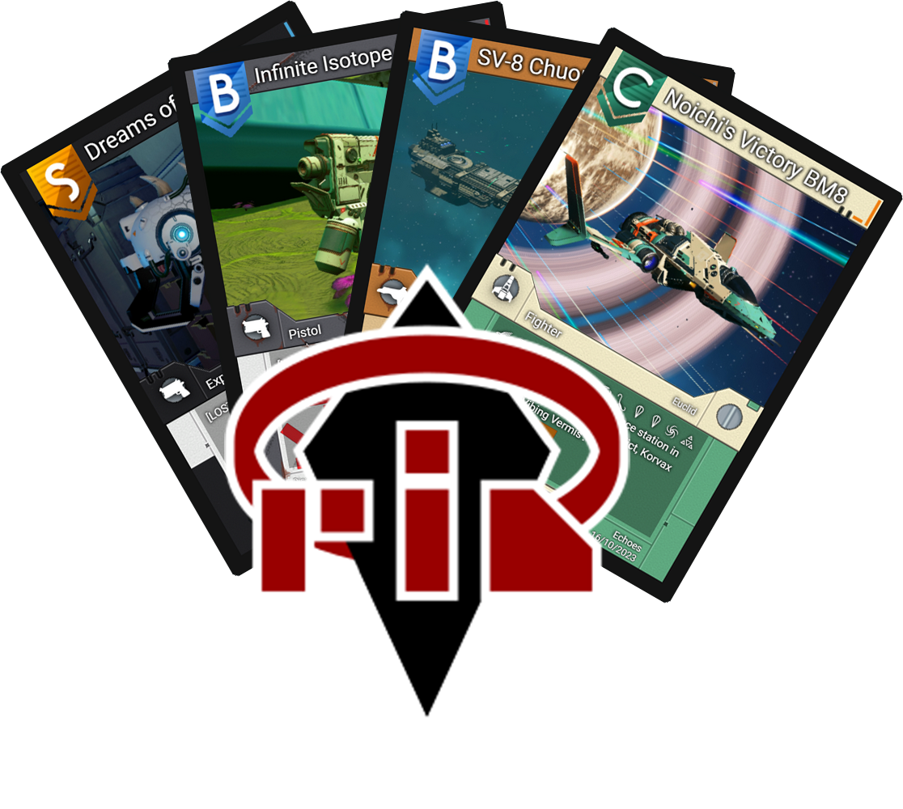 
    
 Is it in your DNA to collect ships? 

</h1>

# FoxTech-DNA

Table of Contents

- [Introduction ](#introduction) 
- [Quick Feature Overview](#quick-feature-overview)
- [Planned Feature Overview](#planned-feature-overview) 
- [Screenshots](#screenshots) 
- [Getting started](#getting-started)
  - [Compatibility](#compatibility)
  - [Requirement](#requirement)
- [Licence](#licence)
- [Contact \& Support](#contact--support)
- [Author](#author)
- [Credits](#credits)  

  
 
# Introduction
${\LARGE\textsf{\color{#f11616}DNA}}$ 
${\LARGE\textsf{\color{#e6edf3}(}}$ 
${\LARGE\textsf{\color{#f11616}D}\normalsize\textsf{\color{#e6edf3}reamingFox’s}}$ 
${\LARGE\textsf{\color{#f11616}N}\normalsize\textsf{\color{#e6edf3}o Man’s Sky}}$ 
${\LARGE\textsf{\color{#f11616}A}\normalsize\textsf{\color{#e6edf3}pplication}}$ 
${\LARGE\textsf{\color{#e6edf3})}}$ 
is a save-editor, of sorts, for the game **No Man’s Sky**. It’s a fan-made extension to the game itself meant to be used alongside it.  
DNA is focused on both style and function, adding features that the game lacks such as: 
- automatic inventory sorting
- automatic charging of technologies
- changing settlement perks
- changing settlement production
- cataloguing ships / multitools / freighters / frigates / pets and more.

You can do all these things, but for a cost. 
You’ll have to transfer units/nanites/quicksilver to the in-app bank account to pay for these services that are provided by made-up companies (to add some flavour) and you’ll have to use items such as Salvage Data and Factory Override Units to make certain changes.  
All this for the sake of further immersion into the game, to fix the issue of money creep, use items you’ll normally never use and as an incentive to play the game even more.
  

 ${\textsf{\color{#f11616}Why did you make this project?}}$  

I like No Man’s Sky, but once you reach the endgame the game becomes rather stale and certain issues start to annoy me. 
- Inventory management becomes tedious.
- I have more Salvage Data and money that I know what to do with. 
- I can’t collect more than 12 ships. 
- I can only own 1 freighter. 
- Only a couple of multitools and pets. 
- Even Frigates have a cap.

So, with no way to spend the endless money, the game (for me) grinds to a halt.  
I used save-editors before such as  [NomNom](https://github.com/zencq/NomNom/tree/master) and the editor by [goatfungus](https://github.com/goatfungus/NMSSaveEditor) to export my ships to text files and decrease my money just to have something to do. But even this became rather tedious to do. 
And thus DNA was born. 
An easy–to-use app, that looks visually pleasing, filled with things for me to extend the lifespan of my enjoyment of the game.
Or at least, that is the idea. 

And now after months of more coding than playing the actual game...  
DNA has reached the point where it is ready for a release.  
Maybe, through my efforts, I’ll drive further engagement to No Man’s Sky. 
And with the help of others, refine the app even further.  

 
 
# Quick Feature Overview
- **Platform selection**
- **Manage saves across platforms**
- **Backups**
  - Automatic backups every time a save-edit is made.
  - Recover saves by restoring a previous backup.
- **Ship management**
	- Catalogue the ships you own.
    - Add all kinds of information such as portal location, system information, etc… 
  - Transfer ships to the database for later use, freeing up slots for you to use.
    - All information is saved. Such as inventory and technologies in the case of ships
  - Transfer ships between saves and different platforms.
	- View your collection in the form of interactive trading cards.
  - Customise your card with the in-app options
  - Export your trading card as an image. (It wouldn’t be a trading card if you couldn’t.)
- **Pet / Freighter / Frigate / Multitool management**
  - You can do the same things as with managing the ships!
  - Catalogue everything
  - Transfer everything to the database or other saves.
  - View everything as cards.
- **Inventory management**
  - Drag and drop items and tech from one inventory to another, similar to the game.
  - An extra account inventory is added to transfer items between saves.
  - Unlock/lock slots.
  - Supercharge/(subcharge?) your tech slots.
  - Quick sort your inventory
	  - Items will be sorted to inventories that already have at least one of that item.
	  - Configure the slots you don’t want to sort.
  - Quick charge all your technologies.
- **Base management**
	- Change the order in which your bases show up in the teleporter screen
	- View the amount of objects you have placed
	- Across all bases and for each base individually
	- View a list of all the objects within a base.
- **Settlement management**
	- General overview of your entire settlement.
	- Change the next judgement of a settlement.
	- Change the production of a settlement.
	- Change the features of a settlement.
- **Recipe finder**
  - Look up any recipe from the game.
	  - Favourite the ones you need for easy access.
- **Game launcher**
  - Set the path to the game and launch the game directly from DNA.
- **Bank/Stocks**
  - Transfer your currencies to a bank and use them for various services.
  - Invest on the stock market for big ~~losses~~ wins.
- **Extras**
  - Unlock new card-styles with salvage data.
  - Animated ‘advertisements’ based on in-game posters.
  - Since DNA is a save–editor at its core you’ll be able to check the developer mode option in the settings which will allow you to add/change items in your inventories.
  - The entire app is contained on your system and available without an internet connection.

 
# Planned Feature Overview
Just to list a few:
- **Service costs for storing properties in the hangars.**
  - These will be deducted weekly from you the in-app bank-account and adjusted based on your standing with various guilds. 
  - Possible to switch this off in the settings.
- **Item mall featuring companies selling in-game items at various prices or in exchange for other items.**
- **Reward system for playing the game when DNA is minimised. (requires minimal resources)**
	- Awards will include currencies, items and new card-styles.
  - Further expansion of the bank to include things such as loans.
- **Option to create your own card textures and use them in DNA** (if there are enough requests for this)
- **Performance**
 
# Screenshots 
  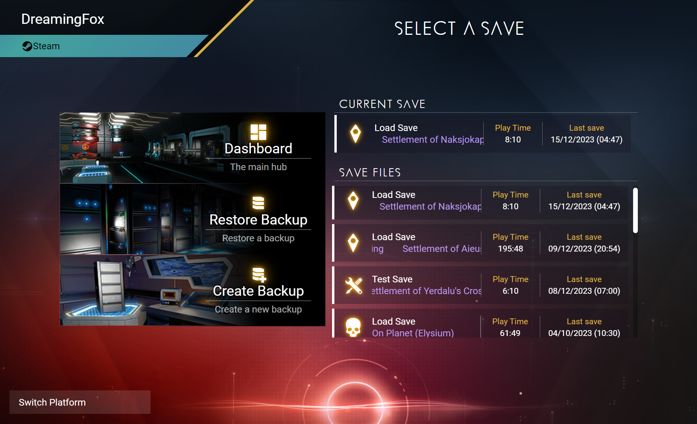  
  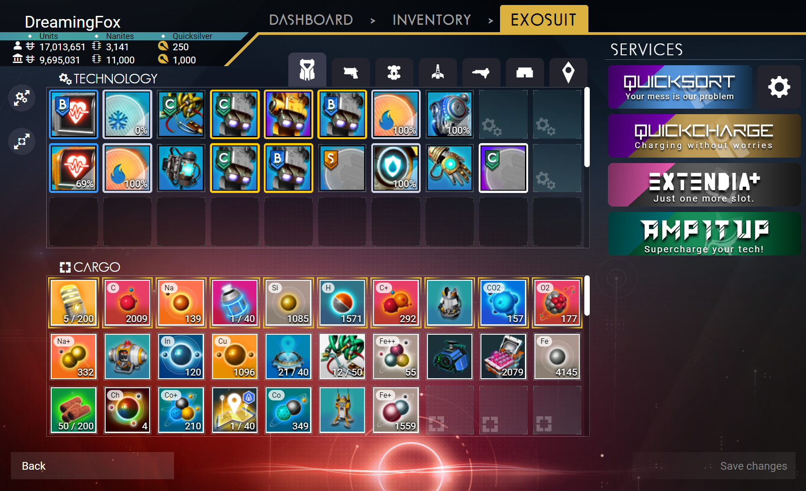  
     
  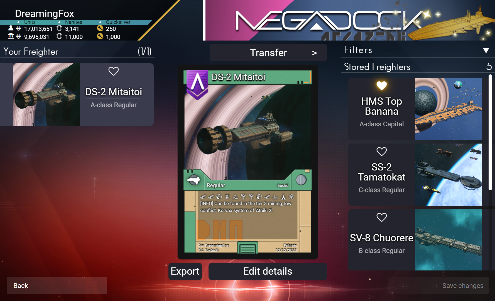  
    
  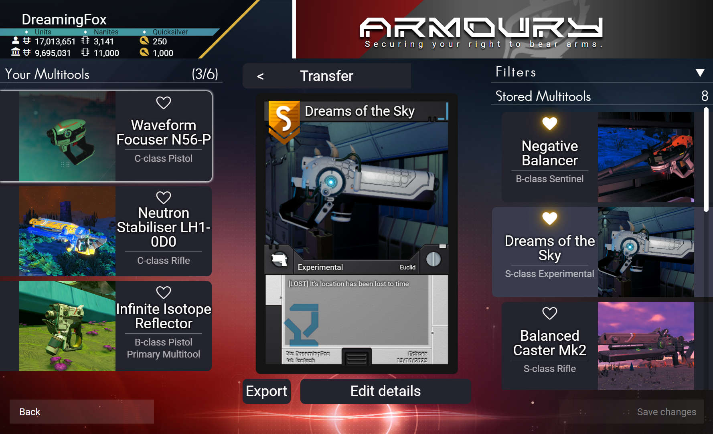  
  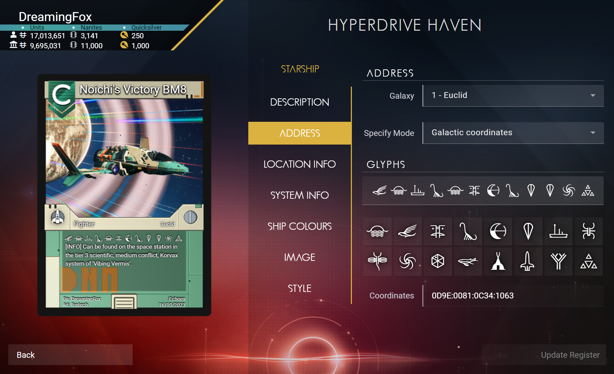  
  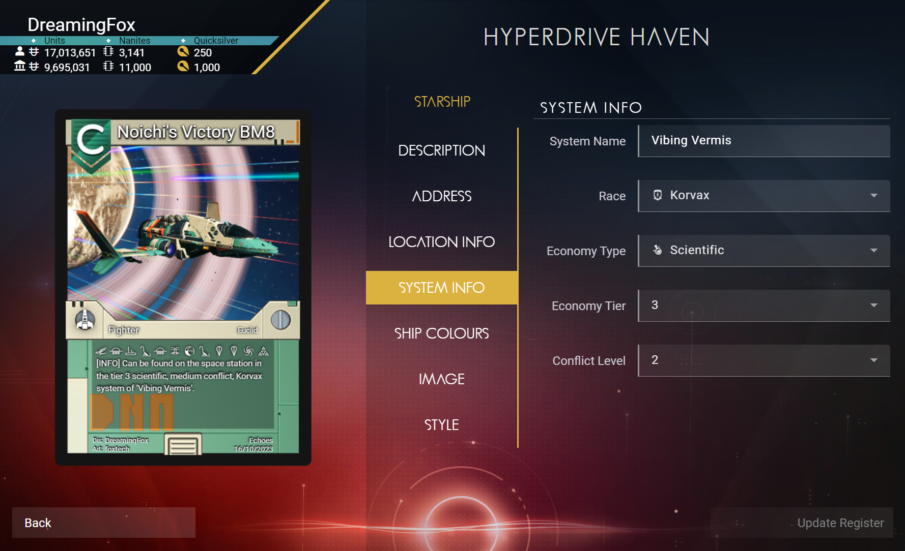  
  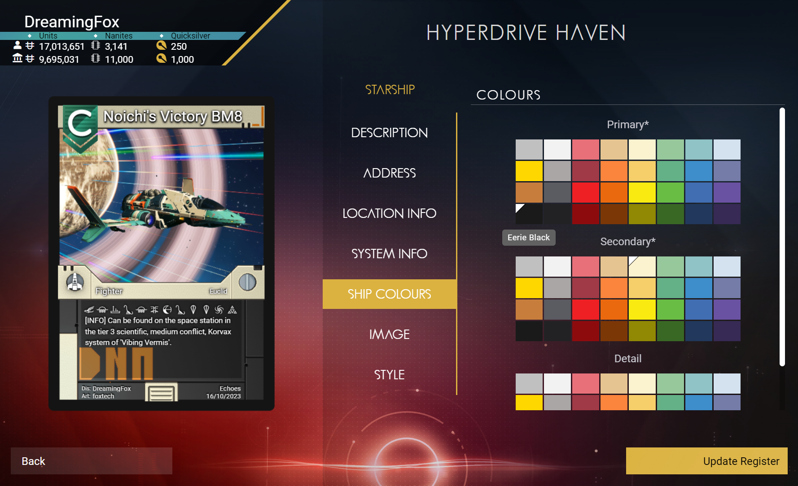  
  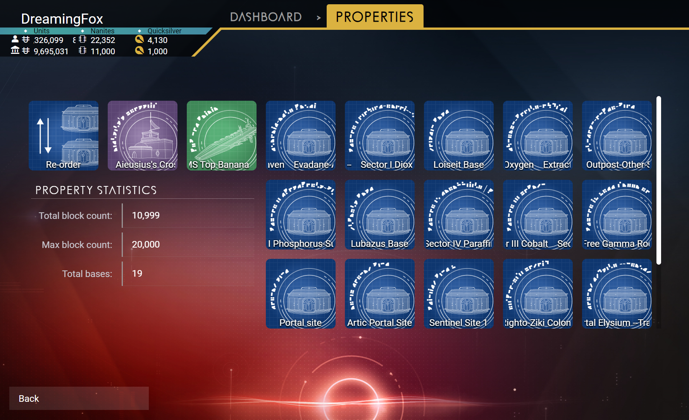  
  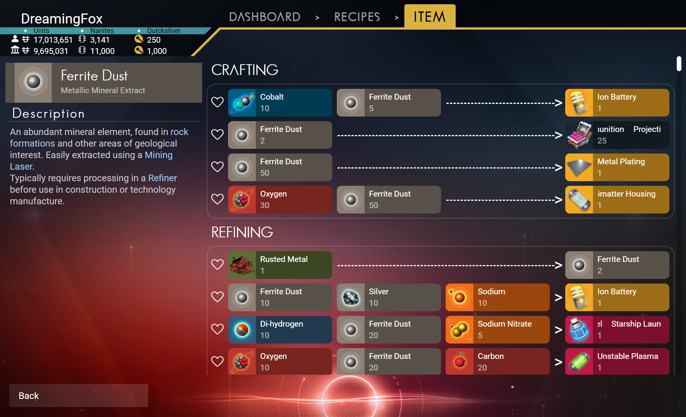  
  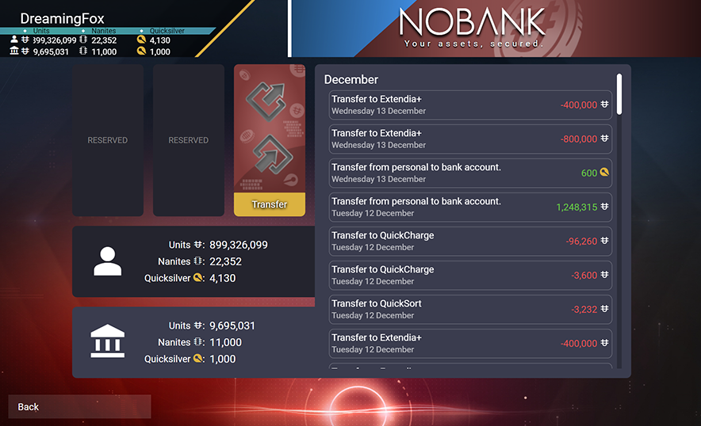  
  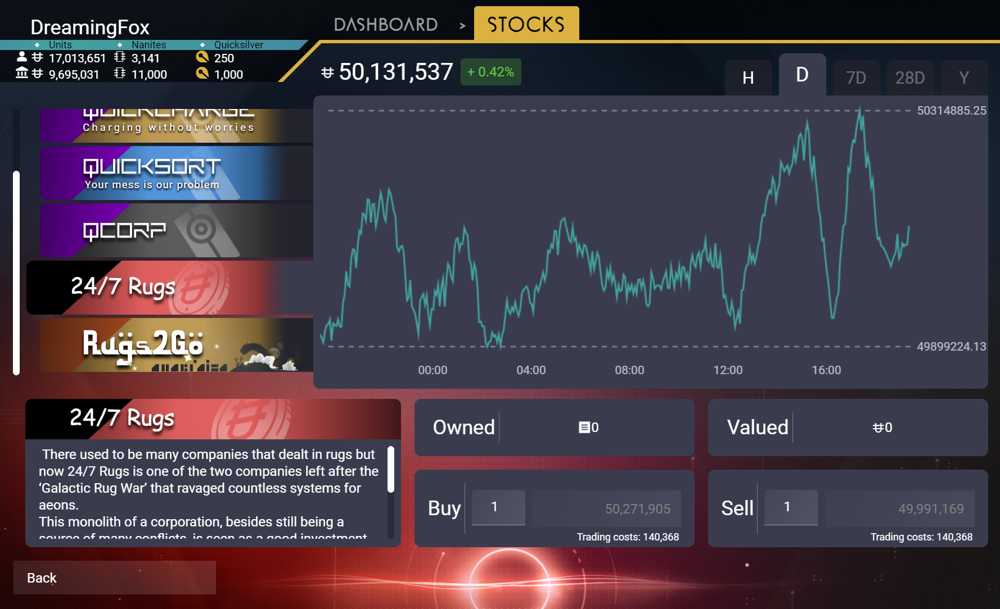  
  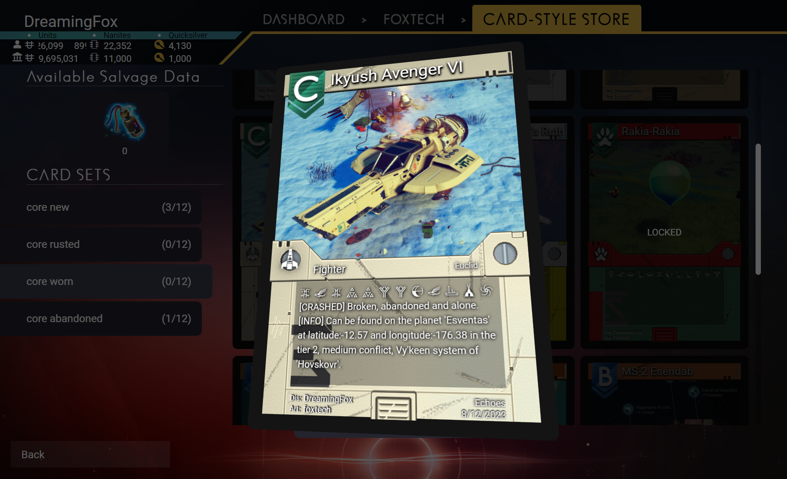  
  
# Getting started 
 
## Compatibility 
Development started since [Interceptor 4.20](https://www.nomanssky.com/interceptor-update/) and has been compatible with every update up to the latest [Echoes 4.45](https://www.nomanssky.com/echoes-update/). 
I take great care to ensure the intergrity of the database that holds all the stored properties. Rest assured that this data is safe with each coming new update.  
(After all, I used DNA myself and I have no plan to lose my own collection)
 
 
Currently only the [Steam](https://store.steampowered.com/app/275850/No_Mans_Sky/)(Windows) and [GOG](https://www.gog.com/game/no_mans_sky)(Windows) platforms are compatible with DNA since these are the only platforms I own the game on. Thus the only platforms I can thoroughly test the app with.
 
## Requirement 
- Make sure you have No Man’s Sky installed.
- Download the latest [release](https://github.com/IzzyTheDreamingFox/FoxTech-DNA/releases) of DNA 
- Run the exe file.
- You’ll be greeted by a short sequence to help you guide through the setup of your preferred platform.
- Once that’s over, you're ready to go!

 
# Licence 
This free-to-use application (and it will stay that way) is licenced under the copyleft GNU General Public Licence.
[MORE INFO](LICENSE) 

 
# Contact & Support
If you have any questions or suggestions you can contact me on the discord server: [discord](https://discord.gg/fk2BWT7hAd) 
 
# Author:
IzzyTheDreamingFox
 
# Credits:

- My obsession/frustration for/at No Man’s Sky: Laying the seed for the idea of DNA.

- [goatfungus-NMSSaveEditor](https://github.com/goatfungus/NMSSaveEditor) Being the first save-editor I used to edit the game. Essentially showing me that save-editing this multiplayer game is possible and allowing the seed to grow roots.

- [zencq-NomNom](https://github.com/zencq/NomNom/tree/master) Being the editor that allowed me to edit even more things. Essentially allowing me to break the game and explore the capabilities of save-editing.

- [monkeyman192-MBINCompiler](https://github.com/monkeyman192/MBINCompiler) Without this, DNA probably wouldn't exist. Thanks to this library I was able to extract all the data I needed from the game along with the mapping to deobfuscate save-files.

- Zgarr. The person that had to listen the most to my No Man’s Sky rambling. Without his listening ear I would have probably given up on the whole project.
